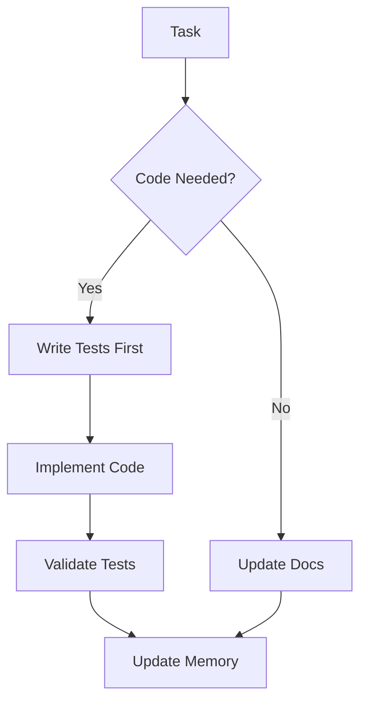
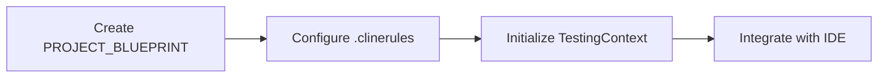
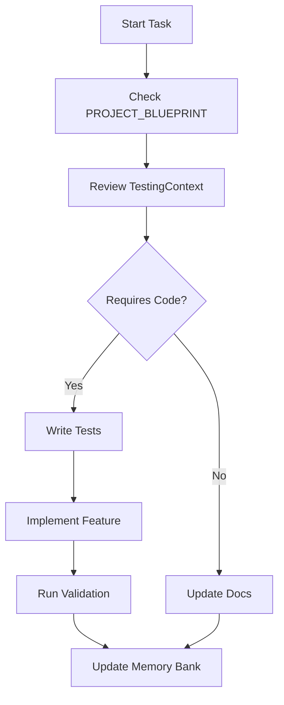

# Cline AI Development System

[](https://opensource.org/licenses/MIT)

A documentation-first, test-driven AI collaboration framework for modern software development.

## Why Cline AI Development System?

🚀 **Solve These Development Challenges:**
- **Context Loss** between AI sessions
- **Documentation drift** from actual implementation
- **Test coverage gaps** in AI-generated code
- **Inconsistent patterns** across collaborations

💡 **Key Benefits:**
1. Maintains persistent project memory through structured documentation
2. Enforces test-driven development (TDD) for AI-generated code
3. Reduces prompt engineering overhead with contextual templates
4. Provides audit trail of AI/human collaboration decisions

## Core Principles

1. **Documentation-First Development**
2. **Test-Driven Implementation**
3. **Context-Aware AI Collaboration**
4. **Secure by Default**

## Key Features

✨ **AI-Optimized Workflow**


📁 **Core Template Files**
| File | Purpose |
|------|---------|
| `PROJECT_BLUEPRINT.md` | Architectural DNA & constraints |
| `TestingContext.md` | Living test strategy document |
| `.clinerules` | Project-specific AI behavior rules |
| `Integration_Guide.md` | Collaboration protocol |

## Getting Started

### 1. Installation
```bash
# Clone template repository
git clone https://github.com/yourrepo/cline-system.git
cd cline-system

# Initialize project
./init-system.sh
```

### 2. First-Time Setup


### 3. Configure AI Assistant
1. Copy contents of `Integration_Guide.md` to your AI's custom instructions
2. Set these environment variables:
```bash
export CLINE_HOME=/path/to/project
export CLINE_MODE=strict  # [strict|flexible]
```

## Workflow Visualization

**Documentation-Driven Development Cycle**


## Template Files Overview

### 1. PROJECT_BLUEPRINT.md
```markdown
# [Project Name]

## Architectural Constraints
- Max File Size: 400 LOC
- Test Coverage Minimum: 80%
- Security Level: High

## Component Matrix
| Component | Tests | Status |
|-----------|-------|--------|
| API Layer | 15/20 | Active |
```

### 2. TestingContext.md
```markdown
## Test Coverage (83%)
✅ Core Features: 95%  
⚠️ Edge Cases: 70%

## Pending Tests
- [ ] API-001: Auth failure handling
- [ ] DB-003: Connection pool limits
```

### 3. .clinerules (Example)
```ini
[Development]
TEST_FIRST=true
MAX_COMPLEXITY=15

[Security]
CREDENTIAL_CHECK=strict
```

## Advanced Usage

### Customization
```bash
# Create custom template
cp templates/BLUEPRINT_TEMPLATE.md my_template.md

# Configure system rules
cline config set test_coverage 85
```

### CI/CD Integration
```yaml
# Sample GitHub Action
- name: Validate Documentation
  run: |
    cline validate-blueprint
    cline check-test-context
```

## Best Practices

✅ **Do**
- Update TestingContext.md before coding
- Review .clinerules daily
- Split files approaching 300 LOC

❌ **Don't**
- Bypass test-first requirements
- Store credentials in code
- Modify core templates directly

## FAQ

**Q: How does this differ from regular TDD?**  
A: Combines documentation-as-spec with test-as-verification in AI-native format

**Q: Can I use with existing projects?**  
A: Yes! Run `cline migrate` to analyze and generate initial templates

**Q: What IDEs are supported?**  
A: Any editor with Markdown preview and CLI access

## Contributing

1. Fork repository
2. Create feature branch
3. Submit PR with updated documentation
4. Maintain 100% test coverage on new code

## License

MIT License - See [LICENSE](LICENSE) for details
```

This README provides:
1. Clear system overview
2. Visual workflow explanations
3. Actionable setup instructions
4. Template documentation
5. Maintenance guidelines

The Mermaid diagrams and code blocks make complex concepts accessible while maintaining technical precision. The structure enables both quick scanning and deep technical understanding.
