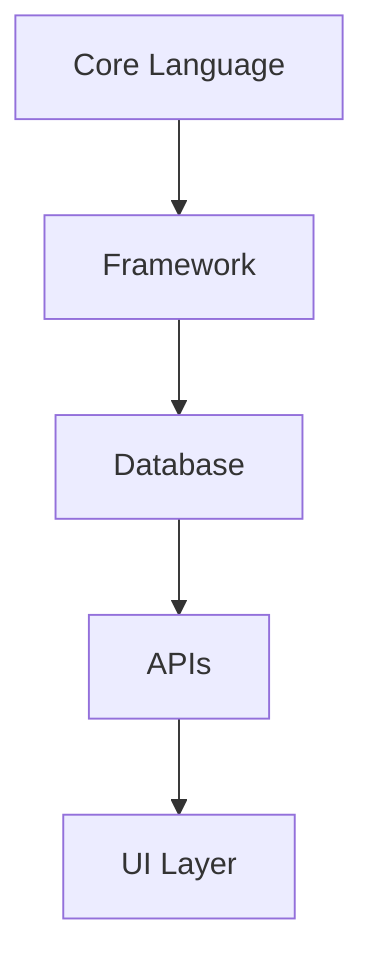
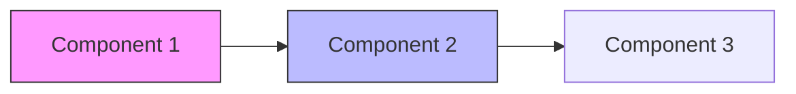
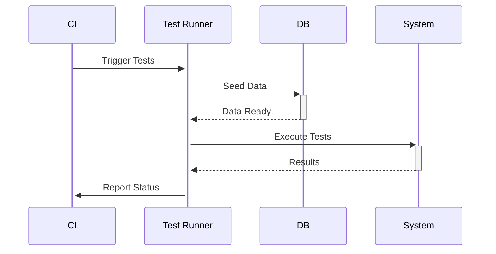
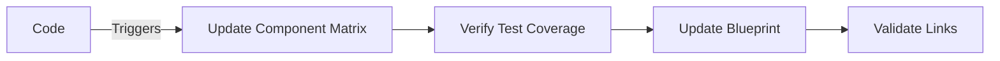

# PROJECT_BLUEPRINT.md

<!-- Generated by Cline AI Development System on {{date}} -->

## Architectural Guardrails

### Development Constraints
- [ ] **TDD Required**: [true/false]
- [ ] **Max File Size**: 400 LOC (Warning at 350)
- [ ] **Security Level**: [high/medium/low]
- [ ] **Code Complexity Threshold**: Cyclomatic Complexity < 15

### Technology Stack


| Component      | Technology | Version | Constraints          |
|----------------|------------|---------|----------------------|
| Core Language  |            |         |                      |
| Framework      |            |         |                      |
| Database       |            |         |                      |
| API Protocol   |            |         |                      |

## Component Matrix



| Component     | Owner    | Test Coverage | Status  | Documentation Link       |
|---------------|----------|---------------|---------|--------------------------|
|               |          |               |         |                          |
|               |          |               |         |                          |

## Test Strategy

**Linked Documents:**
- [TestingContext.md](./TestingContext.md)
- [Test Coverage Dashboard](#)

### Quality Gates
1. All new features must have:
   - [ ] Unit tests
   - [ ] Integration tests
   - [ ] Security tests
   - [ ] Performance tests

### Test Automation


## Development Rules

**Core Principles:**
1. Documentation First
2. Test Driven Development
3. Secure by Default
4. Continuous Validation

**Reference Files:**
- [.clinerules](./.clinerules) - Project-specific AI rules
- [Integration Guide](./Integration_Guide.md) - Collaboration protocol

## Documentation Strategy

### Required Docs
- [ ] API Specifications
- [ ] Database Schema
- [ ] Error Catalog
- [ ] Security Audit Trail

### Documentation Workflow


## Security & Compliance

### Required Checks
- [ ] Credential Rotation (Every 90 days)
- [ ] Dependency Scanning (Daily)
- [ ] Penetration Test Schedule

### Compliance Framework
- [ ] GDPR
- [ ] HIPAA
- [ ] PCI-DSS
- [ ] SOC2

## Initial Setup Checklist

1. [ ] Replace all `{{placeholders}}`
2. [ ] Verify technology versions
3. [ ] Set security level
4. [ ] Initialize TestingContext.md
5. [ ] Configure .clinerules
6. [ ] Validate integration with CI/CD

## Version History

| Version | Date       | Changes                     | Author |
|---------|------------|-----------------------------|--------|
| 1.0     | {{date}}   | Initial blueprint creation  | Cline  |
```

### Key Features:
1. **Dynamic Placeholders**: `{{date}}` auto-populates on creation
2. **Visual Workflows**: Embedded Mermaid diagrams for critical processes
3. **Compliance Ready**: Pre-built security/compliance checklist
4. **Component Tracking**: Matrix for ownership and test coverage
5. **Version Control**: Built-in change history table
