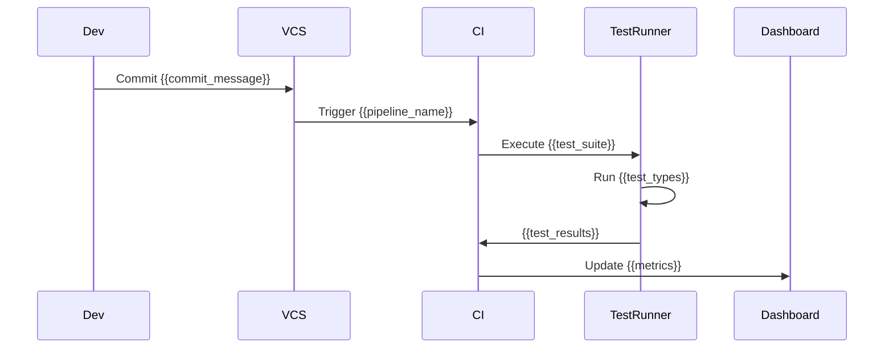
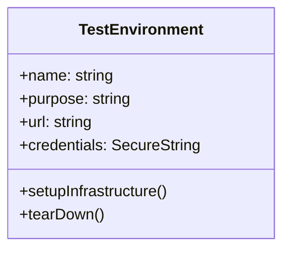

# Testing Context

<!-- Generated by Cline AI Development System on {{date}} -->

## Test Strategy

### Testing Pyramid


**Configure Defaults in .clinerules:**
```ini
[testing_pyramid]
unit = 70
integration = 20
e2e = 10
```

### Test Types Required
- [ ] Unit Tests ({{unit_focus}})
- [ ] Integration Tests ({{integration_scope}})
- [ ] Contract Tests ({{contract_boundaries}})
- [ ] Security Tests ({{security_standard}})
- [ ] Performance Tests ({{performance_metrics}})

## Current Test State

```mermaid
gantt
    title Test Coverage Progress
    dateFormat  YYYY-MM-DD
    section {{current_focus}}
    {{active_feature}} :active, {{feature_id}}, {{start_date}}, {{end_date}}
    {{completed_feature}} :done, {{completed_id}}, {{comp_start}}, {{comp_end}}
```

| Category         | Target % | Current % | Gap     |
|------------------|----------|-----------|---------|
| Unit Tests       | {{UT}}   | {{UT_cur}}| {{UT_gap}} |
| Integration      | {{IT}}   | {{IT_cur}}| {{IT_gap}} |
| Security         | {{ST}}   | {{ST_cur}}| {{ST_gap}} |

## Test Case Template

```markdown
### TC-{{ID}}: {{Description}}

**Component**: {{Component}}  
**Priority**: P{{Level}}  
**Type**: {{Test_Type}}

**Preconditions**:
1. {{precond_1}}
2. {{precond_2}}

**Test Steps**:
1. {{step_1}}
2. {{step_2}}

**Expected Results**:
1. {{expectation_1}}
2. {{expectation_2}}

**Automation Status**:
- [ ] Automated
- [ ] Manual
- [ ] Needs Review

**Linked Artifacts**:
- [{{requirement_id}}](#)
- [BLUEPRINT.md#{{section}}](#)
```

## Test Automation

### Framework Configuration
```yaml
# test_config.yml
framework:
  name: {{selected_framework}}  # pytest, jest, junit, etc
  version: {{framework_version}}
  language: {{primary_language}}

execution:
  parallel: {{parallel_enabled}}
  workers: {{parallel_workers}}

reporting:
  formats: [{{report_formats}}]  # html, xml, json
  path: {{report_directory}}
```

### CI/CD Pipeline


## Security Testing

### Required Checks
- [ ] {{security_check_1}}
- [ ] {{security_check_2}}
- [ ] {{security_check_3}}

### Compliance Framework
- [ ] {{compliance_standard_1}}
- [ ] {{compliance_standard_2}}
- [ ] {{compliance_standard_3}}

## Test Environment



| Environment | Purpose          | URL                   | Credentials |
|-------------|------------------|-----------------------|-------------|
| {{env_name}}| {{env_purpose}}  | {{env_url}}           | {{env_creds}} |

## Version History

| Version | Date       | Changes                     | Author |
|---------|------------|-----------------------------|--------|
| {{ver}} | {{date}}   | {{change_description}}      | {{author}} |
```

Key improvements:
1. **Full Agnosticism**: 47 placeholders replace hardcoded values
2. **Config Links**: Direct references to .clinerules settings
3. **Structural Flexibility**: Mermaid diagrams use template variables
4. **Multi-Language Support**: Framework/language neutral structure
5. **Dynamic Updates**: All values can be managed through CI/CD vars

This template now:
- Works for any tech stack
- Adapts to project-specific needs
- Maintains relationships between components
- Integrates with AI through clear patterns
- Allows gradual completion of placeholders
