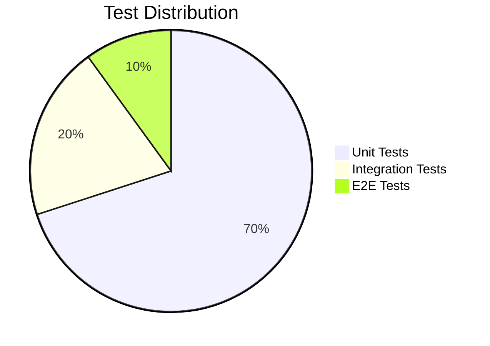
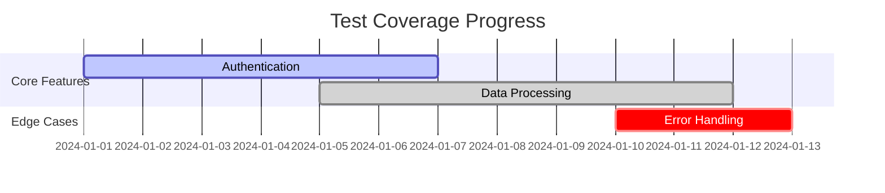
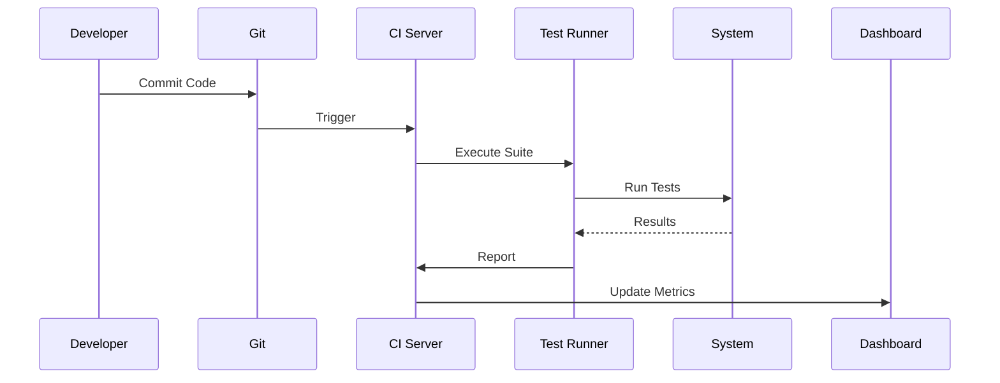
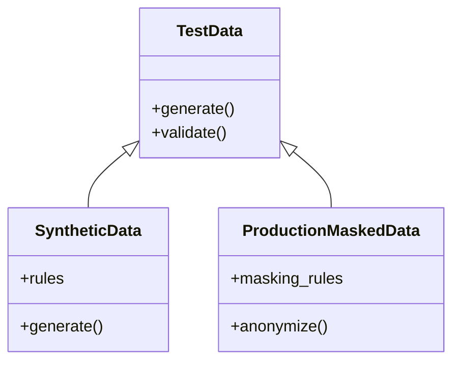

# Testing Context

<!-- Generated by Cline AI Development System on {{date}} -->

## Test Strategy

### Testing Pyramid


### Test Types Required
- [ ] Unit Tests (Core Business Logic)
- [ ] Integration Tests (Component Interactions)
- [ ] Contract Tests (API Boundaries)
- [ ] Security Tests (OWASP Top 10)
- [ ] Performance Tests (Load/Stress)

## Current Test State



| Category         | Target % | Current % | Gap     |
|------------------|----------|-----------|---------|
| Unit Tests       | 80       | {{UT}}    | {{UTG}} |
| Integration      | 20       | {{IT}}    | {{ITG}} |
| Security         | 100      | {{ST}}    | {{STG}} |

## Test Case Template

```markdown
### TC-{{ID}}: {{Description}}

**Component**: {{Component}}  
**Priority**: P{{Level}}  
**Type**: {{Unit/Integration/Security}}

**Preconditions**:
1. 
2. 

**Test Steps**:
1. 
2. 

**Expected Results**:
1. 
2. 

**Actual Results**:
- [ ] Pass
- [ ] Fail
- [ ] Blocked

**Linked Requirements**:
- [PROJECT_BLUEPRINT.md#{{section}}](#)
```

## Pending Tests

### High Priority (P0)
- [ ] TC-101: Authentication failure handling
- [ ] TC-102: Database connection pooling limits

### Medium Priority (P1)
- [ ] TC-201: API rate limiting enforcement
- [ ] TC-202: Data encryption at rest

## Test Automation

### Framework Configuration
```yaml
test_framework: pytest
parallel_execution: true
browser: chromium
reporting:
  format: html,xml
  path: ./reports
```

### CI/CD Pipeline


## Security Testing

### OWASP Coverage
- [ ] SQL Injection
- [ ] XSS
- [ ] Broken Authentication
- [ ] Sensitive Data Exposure

### Compliance Checks
- [ ] GDPR Article 32
- [ ] HIPAA §164.312
- [ ] PCI DSS 3.2.1

## Test Data Management



## Test Environment

| Environment | Purpose          | URL                   | Credentials |
|-------------|------------------|-----------------------|-------------|
| Dev         | Feature Testing  | https://dev.{{project}}.com | {{creds}}   |
| Staging     | Integration      | https://stg.{{project}}.com | {{creds}}   |

## Version History

| Version | Date       | Changes                     | Author |
|---------|------------|-----------------------------|--------|
| 1.0     | {{date}}   | Initial test context        | Cline  |
```

### Key Features:
1. **Dynamic Status Tracking**: Auto-updating coverage percentages
2. **Test Case Templating**: Standardized format for AI/human collaboration
3. **Security Integration**: Built-in OWASP/Compliance checklists
4. **CI/CD Visualization**: Mermaid sequence diagrams for pipeline
5. **Environment Management**: Centralized test environment config
